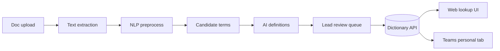

# Hackday Acronyms — Master Plan

> **Source of truth for humans and agents.** Read this first, then [architecture.md](architecture.md), [CONTRIBUTING.md](../CONTRIBUTING.md), and [demo-script.md](demo-script.md).

**Product in one sentence:** Lead uploads docs → pipeline extracts candidate jargon → AI proposes definitions → lead reviews/edits → dictionary is indexed so anyone can look up terms (web now; Teams personal tab via sideload for demo).



---

## Assumptions

- ~1–2 day hackathon
- Azure OpenAI or OpenAI API available (optional — heuristics work without a key)
- Someone can **sideload** a Teams app in the tenant (or use web fallback)
- Stack: **monorepo** with Next.js (`apps/web`) + FastAPI dictionary API (`apps/api`) + Python NLP (`apps/nlp`)

---

## 1. Collaboration setup

### Branching & PRs

- Protect `main`: require 1 review, no direct pushes (owner enables — see [github-admin.md](github-admin.md))
- Branches: `feature/<person>-<thing>`
- Squash merge; tag demo-ready commits `demo-v1`

### Issues / board

- Milestone: **Hackday MVP**
- Labels: `area:api` `area:nlp` `area:web` `area:teams` `area:demo` `priority:p0` `good-first`
- Columns: Backlog → Doing → Blocked → Done

### Team of 4 — fixed ownership

| Person | Owns | Primary folders |
|--------|------|-----------------|
| **A — Lead / PM+Integrations** | Repo hygiene, README, env, Teams, demo, deploy | `/docs`, `/teams`, root |
| **B — Backend / Dictionary** | Auth roles, CRUD, upload, storage, APIs | `/apps/api` |
| **C — NLP / AI** | Extraction, prompts, definitions, fixtures | `/apps/nlp` |
| **D — Frontend** | Upload, review, lookup UI | `/apps/web` |

**Rule:** one owner per folder; others open PRs into that area only with the owner’s review.

### Repo layout

```text
hackday-acronyms-application/
├── AGENTS.md                 # entrypoint for AI coding agents
├── README.md                 # quick start
├── CONTRIBUTING.md           # branch/PR/ownership
├── docs/
│   ├── PLAN.md               # THIS FILE — master plan
│   ├── architecture.md       # JSON contracts + merge rules
│   ├── demo-script.md        # live demo + backup checklist
│   ├── github-admin.md       # branch protection / collaborators
│   └── sample-docs/          # planted acronyms for demos
├── apps/api/                 # FastAPI dictionary + upload
├── apps/nlp/                 # extractors + definitions
├── apps/web/                 # Next.js UI
├── teams/                    # sideloadable Teams personal tab
└── scripts/                  # seed-demo, package-teams
```

---

## 2. MVP scope

### Must-have (P0)

1. **Upload** text/PDF/Markdown (PDF via text extract; paste-text fallback)
2. **Pipeline:** candidates (acronyms, CamelCase, capitalized entities, repeated noun phrases) → AI/heuristic draft definitions with confidence
3. **Review queue** for lead: approve / edit / reject
4. **Dictionary** roles: anyone can propose/add; only lead can edit/approve
5. **Lookup UI:** paste snippet; unclear terms clickable → definition popover
6. **Re-upload:** merge new candidates; don’t wipe approved; flag conflicts for lead

### Explicitly cut (P1 / if time)

- Deep noun-phrase quality tuning beyond heuristics
- Multi-team tenancy beyond a single `teamId`
- AppSource / Graph messaging extension deep integration
- Perfect PDF layout / OCR

### Roles

| Role | Can do |
|------|--------|
| `member` | Suggest terms, search, lookup |
| `lead` | Upload, approve/edit/delete, re-run extraction |

Hackday auth: headers `X-Role: lead|member` and optional `X-User: <name>` (UI toggles this).

---

## 3. Build phases (parallelizable)

### Phase 0 — Bootstrap

1. Clone; monorepo skeleton
2. Scaffold web + api + nlp
3. SQLite (zero infra) + `.env.example`
4. Seed fake team terms
5. Sample wiki with planted acronyms

### Phase 1 — Dictionary API (`apps/api`)

- Models: `Term` (`term`, `definition`, `aliases`, `status`, `source`, `kind`, `confidence`, …)
- Endpoints: `GET/POST/PATCH /terms`, `GET /review`, `POST /review/:id/approve|reject`, `POST /documents/upload`, `POST /documents/paste`

### Phase 2 — NLP (`apps/nlp`) — fine-tuning focus

```text
raw text
  → normalize
  → candidate extractors (parallel):
       acronyms · camelCase · capitalized entities · repeated noun phrases
  → dedupe / score
  → LLM or heuristics → definition + confidence
  → CandidateTerm[]
```

- `POST /nlp/extract`
- Fixtures in `apps/nlp/fixtures/`; `pytest` + `scripts/eval_fixture.py`
- API mocks NLP if service is down

### Phase 3 — Web (`apps/web`)

- Lead: upload + review table
- Member: dictionary + suggest
- Lookup: highlight + popover; jargon-assist toggle (localStorage)

### Phase 4 — Integrate merge

- Upload → NLP → insert `pending` (skip exact duplicates of `approved`)
- Re-upload: bump `last_seen_at`; set `conflict_note` if AI disagrees with approved definition

### Phase 5 — Teams without store approval

1. Web works in browser first
2. Personal tab iframes same Next.js URL (**HTTPS** via ngrok/cloudflared)
3. Package `teams/manifest.json` + icons → sideload zip
4. Teams → Apps → Upload a custom app

**Fallback:** full-screen web + show manifest as the integration path.

**Later:** messaging extension, `@AcronymBot`, AppSource.

Details: [teams/README.md](../teams/README.md)

---

## 4. Demo (3–4 min)

Full script: [demo-script.md](demo-script.md)

1. Problem: chat jargon (`PIR` / `GTM` / `BAU`)
2. Lead uploads `sample-docs/team-wiki.md` → review → approve
3. Member lookup with clickable definitions
4. Member suggests a term → lead approves
5. Re-upload `team-wiki-v2.md` → only new pending terms
6. Teams tab or web fallback

Record a 60s backup video; keep seed data offline.

---

## 5. Day-of timeline (8-hour example)

| Hours | Focus |
|-------|--------|
| 0–1 | Bootstrap, roles, sample doc, env keys |
| 1–4 | Parallel: API / NLP / UI |
| 4–5 | Integrate upload→extract→review |
| 5–6 | Lookup highlighting + polish |
| 6–7 | Teams sideload or web fallback + rehearsal |
| 7–8 | Bug bash, seed reset, backup video |

---

## 6. Collaboration habits

- **Contract first:** [architecture.md](architecture.md) for `Term` / `CandidateTerm` shapes
- **Mock NLP** until Person C’s endpoint is ready
- **10-minute standup** on the issue board only
- **Demo owner:** Person A owns the happy path; don’t change seed data silently

---

## 7. Where to fine-tune AI

| File | Purpose |
|------|---------|
| `apps/nlp/app/extractors.py` | Acronym / CamelCase / entity / noun-phrase rules |
| `apps/nlp/app/define.py` | Heuristic defs + OpenAI/Azure prompts |
| `apps/nlp/fixtures/` | Expected terms for eval |
| `apps/nlp/tests/` | Regression tests |
| `apps/nlp/scripts/eval_fixture.py` | Precision/recall helper |

Set `OPENAI_API_KEY` (or Azure vars) in `.env` when ready; without a key, heuristics still run.

---

## Doc index

| Doc | Audience |
|-----|----------|
| **[PLAN.md](PLAN.md)** (this file) | Everyone + agents — full plan |
| [architecture.md](architecture.md) | Shared API/NLP contracts |
| [demo-script.md](demo-script.md) | Presenters |
| [github-admin.md](github-admin.md) | Repo owner |
| [../AGENTS.md](../AGENTS.md) | AI coding agents |
| [../CONTRIBUTING.md](../CONTRIBUTING.md) | PR workflow |
| [../teams/README.md](../teams/README.md) | Teams sideload |
| [../README.md](../README.md) | Quick start |
