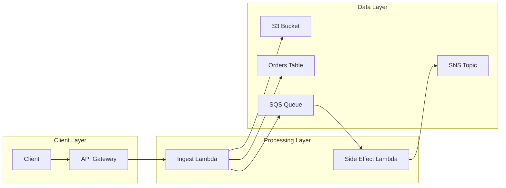

## System Overview

This document describes a fictional internal product called the Launch Ops Portal. The platform helps the team coordinate releases, monitor incidents, and keep shared knowledge in one place. It uses a mix of standard cloud services and a few intentionally invented team-specific terms for demo purposes.

## Architecture Flow

The API Gateway receives requests from the client. The Ingest Lambda validates the payload, stores a copy in the S3 Bucket, and updates the Orders Table. Work that needs follow-up is pushed to the SQS Queue, where the Side Effect Lambda sends notifications through the SNS Topic.

## Team-Specific Jargon and Acronyms

The team uses several invented phrases during delivery. A release is often discussed as a Launch Wave, and the rollout is tracked through a DriftLoop review. When a customer-facing issue happens, the team may open a TLR before the next handoff. The org also uses the term REX for a release exception and RAMP for a readiness checkpoint.

The incident team keeps a PulseRoom during major events and uses the phrase DesignDoc for the implementation plan. A feature can also be gated behind a ToggleGate, and the team may mention the OpsLead when discussing rollout ownership.

## Glossary

- TLR: Team Launch Readiness review
- REX: Release Exception record
- RAMP: Readiness and Mobilization Planning checkpoint
- PulseRoom: temporary coordination space during an urgent incident
- DesignDoc: shared design note for a change
- ToggleGate: switch that enables or disables a feature safely
- OpsLead: person accountable for the rollout execution
- DriftLoop: recurring review for release drift and follow-up issues